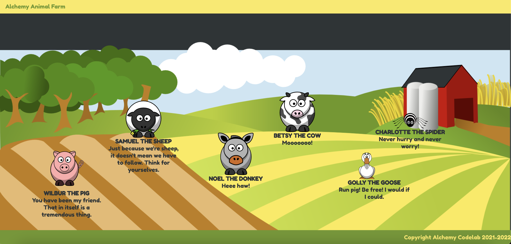
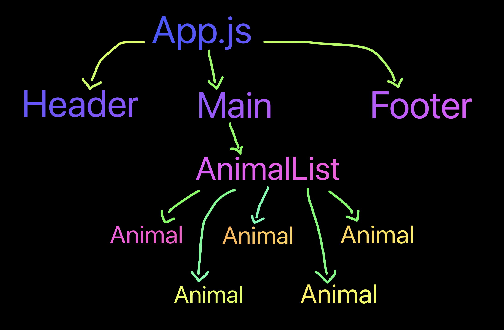

# React Animal Farm

### Learning Objectives

- Describe and utilize the classic React gotchas:
  - Styles: using className to set styles versus `style = {{ background: 'magenta' }}`
  - Images: importing images versus putting assets in the public directory
  - The need for fragments and returning single children from component render methods"
- Use Netlify to deploy a React app
- Use attributes in parent components to pass data down to child components as props
- Use {} as "portals" in the render method to do JavaScript inside our HTML
- Use .map to iterate over an array and render new elements for each item in an array.
- Use jsx to product & render a React component

### Description

Welcome to the Alchemy Farm! For this deliverable, you will practice creating functional components, mapping through lists and rendering a component for each item.

### Acceptance Criteria

- Use the data file, background image, and animal images in this repo to complete this assignment. Work off of this template: [React Base Template](https://github.com/alchemycodelab/react-base-template)
- `<App />` component should import the animals array and pass it to `<Main />`. It should pass an email to the footer and a greeting to the header.
- The `<Header />` should render its greeting prop, and the `<Footer />` should render its contact email prop.
- `<Main />` should import `background.png` and set it as a background image on the `<main>` element. Look to the animal half-baked to see how this was done. `<Main />` will also pass `animals` down the the `<AnimalList />` component
- `<AnimalList />` component should use a `.map` to loop through and render an `<Animal />` component for each animal in the animals array passed to it from the parent.
- Animals should be positioned dynamically using the `style` attribute in JSX and props
- App should be deployed on Netlify

### Rubric

| User should be able to . . .                                                         |             |
| :----------------------------------------------------------------------------------- | ----------: |
| Visit the deployed app on Netlify, with link in the About section of the Github repo |  **required for grading** |

| Components                                                                                |             |
| :----------------------------------------------------------------------------------- | ----------: |
| All components have no errors (especially `imports`, `className` or `key` errors) in the console  |  2 |
| `App()` : renders `Header`, `Footer`, and `Main` |2|
| `App()` : passes props correctly to `Header` and `Footer` |2|
| `App()` : imports animal data array and passes is as props `Main` |2|
| `Main({ animals })` : This component contains the background image on a div and passes the `animals` array down to the `AnimalList` component |3|
| `Header({ greeting } )` : Renders a header with a `greeting` prop nicely rendered |1|
| `Footer({ email })` : Renders a footer with a `email` prop nicely rendered |1|
| `Animal({ name, type, says })` : renders the animal name, saying, and image using the `name` `type` and `says` props |2|
| `AnimalList({ animals })` : maps over the animal array in props without errors.  |2|
| `AnimalList({ animals })` : renders an `Animal` for each item in the array, suppling a `name`, `type`, `says` and unique `key` prop to each `Animal`.  |3|
